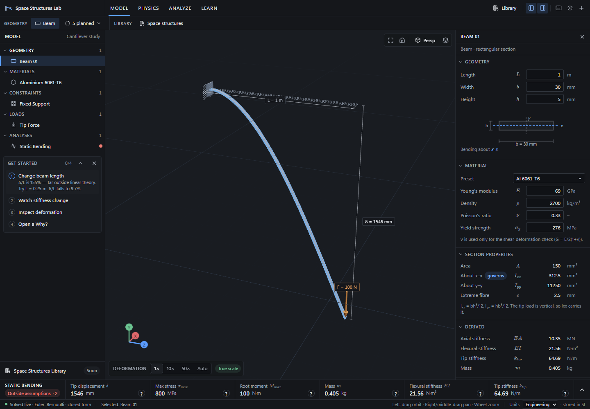

# Space Structures Lab

An interactive structural-engineering laboratory for space structures, which
aims to sit between CAD, structural analysis, interactive teaching and a
space-structures research atlas.

The core loop is **Learn ↕ Build ↕ Analyze ↕ Understand**. You change one
physical parameter, the 3D model and the results respond at once, and the app
explains *why*.

This release covers **Milestone 0** (a CAD-style application shell) and
**Milestone 1** (a cantilever-beam structural playground). It deliberately
does only that.



## Run

Requires Node 20+ (developed on Node 24).

```bash
npm install
npm run dev          # http://127.0.0.1:5180
```

## Deploy to Vercel

This is a client-rendered Vite app. Import the repository into Vercel and use
the detected Vite settings, or set these values manually:

| Setting | Value |
|---|---|
| Framework preset | Vite |
| Build command | `npm run build` |
| Output directory | `dist` |
| Install command | `npm install` (default) |

`vercel.json` sends app routes to `index.html`, so client-side routes continue
to work when opened directly. No server, database, or environment variables
are required for the current app.

The model is stored in browser `localStorage`. Models saved on `localhost`
will not appear automatically on the Vercel domain because browser storage is
isolated by origin.

| Command | What it does |
|---|---|
| `npm run dev` | Development server |
| `npm run build` | Type-check and production build to `dist/` |
| `npm run preview` | Serve the production build |
| `npm test` | Unit tests (Vitest), 131 tests |
| `npm run test:ui` | End-to-end, accessibility and screenshot tests (Playwright), 31 tests. Starts the dev server if one isn't running. First run needs `npx playwright install chromium`. |
| `npm run typecheck` | TypeScript, strict mode |

## What works

**Shell (M0)**
- **Workspaces:** Model / Physics / Analyze / Learn. They are modes over one
  model and one persistent viewport. Each has its own ribbon tools, tree
  emphasis and dock tab.
- **Model tree:** Geometry, Materials, Constraints, Loads and Analyses. It
  supports expand/collapse, keyboard navigation, visibility toggles
  (display-only), and a "Frame in view" action.
- **Selection sync:** selection and hover are shared between the tree, the
  viewport and the inspector.
- **3D viewport** (Three.js / React Three Fiber, render-on-demand):
  - orbit (left drag), pan (right or middle drag), zoom to cursor;
  - Fit (`F`), Home (`H`), perspective/orthographic (`P`);
  - grid, axis gizmo, and dimension lines for L and δ;
  - selection and hover highlight, and a pointer cursor over pickable objects.
- **Contextual inspector:**
  - beam: geometry, material, section properties, derived values;
  - material; support (with reactions); load (magnitude, direction);
  - analysis: status, display options, planned analysis types;
  - project: units.
- **Analysis dock:** an always-visible result strip, plus Results, Sensitivity,
  Learn and Assumptions tabs. The dock is resizable.
- **Units:** SI is used internally. The display switches between Engineering
  (mm, MPa, GPa…) and SI base without touching the physical state.
- **Theme and persistence:** dark and light themes; the model persists across
  reloads.
- **Responsive layout:** desktop-first. Below 768 px it becomes a
  viewport-first phone layout with bottom sheets.
- **Space Structures Library:** booms, membranes, tensegrity and precision
  structures are listed as *planned* and cannot be opened.

**Cantilever playground (M1)**
- **Model:** rectangular Euler–Bernoulli cantilever with a tip load (vertical
  or lateral).
- **Live results:**
  - δ, σ_max, M_max, V and mass;
  - EA, EI and k_tip;
  - tip rotation and margin of safety.
- **Deformed shape:** drawn from the analytical v(z), with sections kept
  normal to the deflected axis. The undeformed outline can be shown alongside.
- **Deformation scale:** 1× / 10× / 50× / Auto. Exaggerated or reduced
  drawings are always labelled, and the true δ is always shown.
- **Bending-stress contour** with a legend (tension/compression).
- **Ratio chips on every result:** each result shows how it changed since the
  edit began (edit L from 1 to 2 m and δ shows **×8**).
- **Why?** on the main results: the equation, the main drivers with measured
  exponents, ±10 % and ×2 what-ifs, and the current model's numbers.
- **Learn:** stiffness, deflection and stress, each as equation + intuition +
  this beam's values. It also has a "what just changed" table that splits
  any edit into its scaling laws and checks them against the solver.
- **Sensitivity:** sweep L, h, b, E or F over 0.5×–2× and plot δ, σ, k or m,
  on log–log axes (slope = exponent) or linear axes. Clicking the plot sets
  the value.
- **Assumptions:** every Euler–Bernoulli assumption is disclosed and checked
  live — slenderness, yield, small deflection, shear deformation,
  isotropy, lateral–torsional buckling.
- **Material presets:** Al 6061-T6, Al 7075-T6, steel 4130, Ti-6Al-4V, and
  CFRP. The CFRP preset is marked **simplified isotropic / educational**.
  Any edited value becomes a labelled custom material.
- **Input validation** (L, b, h, E, ρ > 0; −1 < ν < 0.5; F ≥ 0) with messages
  at the field. The model keeps its last valid state.
- **Onboarding:** four steps, each completed by a real action, with a computed
  suggestion when the model is outside its assumptions.

## Structural assumptions

Euler–Bernoulli beam: slender, linear elastic, small deformation, plane
sections remain plane, shear deformation neglected, isotropic equivalent
material, static tip load.

All of these are visible in the app and checked against the current model.
Full equations, conventions (section axes follow Megson: z along the beam,
Ixx = bh³/12 about the horizontal axis), thresholds and their elastica
calibration are in [docs/STRUCTURAL_MODEL_ASSUMPTIONS.md](docs/STRUCTURAL_MODEL_ASSUMPTIONS.md).

> **Note on the default example.** The brief's starting case (L = 1 m,
> 30 × 5 mm, Al, F = 100 N) is far outside linear theory: δ/L = 155 % and
> σ = 2.9 × yield. The app uses it unchanged, because it is also the specified
> reference case, and says so. The status turns red, and the guide suggests
> L = 0.25 m to return to δ/L < 10 %.

## Current limitations

- Only one structure: a rectangular cantilever with a fixed root and a tip
  point load.
- No other supports, distributed loads, dynamics, buckling analysis,
  plasticity or large-deflection solver. These are roadmap items and are
  shown as "planned", not faked.
- CFRP is a scalar-E idealisation. No laminate mechanics.
- Mobile layout is for viewing and light editing.
- Tested in desktop Chromium with software WebGL and in mobile emulation;
  not on physical devices.

## Documentation

| Document | Contents |
|---|---|
| [IMPLEMENTATION_AUDIT.md](docs/IMPLEMENTATION_AUDIT.md) | Starting point, stack decision (Vite over Next.js, with reasons), risks |
| [ARCHITECTURE.md](docs/ARCHITECTURE.md) | Layers, data flow, schema, viewport, state, testing, how to extend |
| [STRUCTURAL_MODEL_ASSUMPTIONS.md](docs/STRUCTURAL_MODEL_ASSUMPTIONS.md) | Equations, conventions, assumption checks, materials, validation |
| [UI_VALIDATION_REPORT.md](docs/UI_VALIDATION_REPORT.md) | Viewports, screenshots, reference case, 29 issues found and fixed, self-critique |
| [FUTURE_ROADMAP.md](docs/FUTURE_ROADMAP.md) | M2–M10 and the hooks already in place |

## Stack

Vite 7 · React 19 · TypeScript 5.9 (strict) · three.js 0.180 ·
@react-three/fiber 9 · @react-three/drei 10 · Zustand 5 · Tailwind CSS 4 ·
Radix (Popover, Dialog, Tooltip) · KaTeX · lucide-react ·
react-resizable-panels 4 · Vitest 3 · Playwright 1.63 · axe-core.

## Project layout

```
src/
  core/units.ts          units: SI ⇄ display, formatting, parsing
  lib/structures/        pure structural math (no React)
  model/                 document schema, resolver, cached solve
  state/store.ts         Zustand store
  components/            field, section, segmented, TeX, tooltip primitives
  features/              shell · tree · viewport · inspector · results ·
                         learn · sensitivity · library
tests/e2e/               reference case, interactions, accessibility
tests/visual/            screenshot capture → docs/screenshots/
scripts/inspect.mjs      ad-hoc screenshot/inspection tool
```
